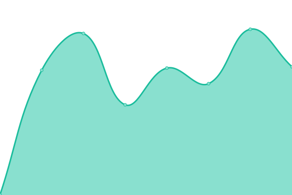

# [📈 Live Status](https://h3infra.github.io/h3.upptime-monitor): <!--live status--> **🟧 Partial outage**

This repository contains the open-source uptime monitor and status page for [h3infra](https://h3infra.github.io/h3.upptime-monitor), powered by [Upptime](https://github.com/upptime/upptime).

With [Upptime](https://upptime.js.org), you can get your own unlimited and free uptime monitor and status page, powered entirely by a GitHub repository. We use [Issues](https://github.com/h3infra/upptime-monitor/issues) as incident reports, [Actions](https://github.com/h3infra/upptime-monitor/actions) as uptime monitors, and [Pages](https://h3infra.github.io/upptime-monitor) for the status page.

<!--start: status pages-->
<!-- This summary is generated by Upptime (https://github.com/upptime/upptime) -->
<!-- Do not edit this manually, your changes will be overwritten -->
<!-- prettier-ignore -->
| URL | Status | History | Response Time | Uptime |
| --- | ------ | ------- | ------------- | ------ |
|  [FiberDigital](https://www.fiber.com.au/) | 🟥 Down | [fiber-digital.yml](https://github.com/h3infra/upptime-monitor/commits/HEAD/history/fiber-digital.yml) | 

 3988ms
     
 | 

<a href="https://h3infra.github.io/upptime-monitor/history/fiber-digital">100.00%</a>
    

|  [Amrapali Indian Cuisine](https://www.amrapali.com.au/) | 🟩 Up | [amrapali-indian-cuisine.yml](https://github.com/h3infra/upptime-monitor/commits/HEAD/history/amrapali-indian-cuisine.yml) | 

 865ms
     
 | 

<a href="https://h3infra.github.io/upptime-monitor/history/amrapali-indian-cuisine">100.00%</a>
    

|  [Orderart](https://www.orderart.com.au/) | 🟩 Up | [orderart.yml](https://github.com/h3infra/upptime-monitor/commits/HEAD/history/orderart.yml) | 

 621ms
     
 | 

<a href="https://h3infra.github.io/upptime-monitor/history/orderart">100.00%</a>
    

|  [habitat3](https://www.habitat3.com.au/) | 🟩 Up | [habitat3.yml](https://github.com/h3infra/upptime-monitor/commits/HEAD/history/habitat3.yml) | 

 235ms
     
 | 

<a href="https://h3infra.github.io/upptime-monitor/history/habitat3">100.00%</a>
    

|  [Test Fake Site](https://www.gootestgle.com) | 🟥 Down | [test-fake-site.yml](https://github.com/h3infra/upptime-monitor/commits/HEAD/history/test-fake-site.yml) | 

 0ms
     
 | 

<a href="https://h3infra.github.io/upptime-monitor/history/test-fake-site">100.00%</a>
    

<!--end: status pages-->

[**Visit our status website →**](https://h3infra.github.io/upptime-monitor)

## 📄 License

- Powered by: [Upptime](https://github.com/upptime/upptime)
- Code: [MIT](./LICENSE) © [Anand Chowdhary](https://anandchowdhary.com), supported by [Pabio](https://pabio.com)
- Data in the `./history` directory: [Open Database License](https://opendatacommons.org/licenses/odbl/1-0/)
